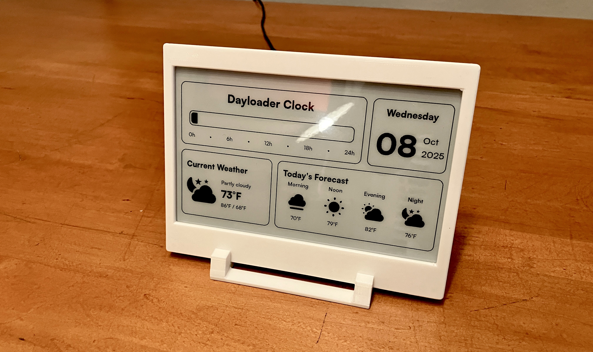
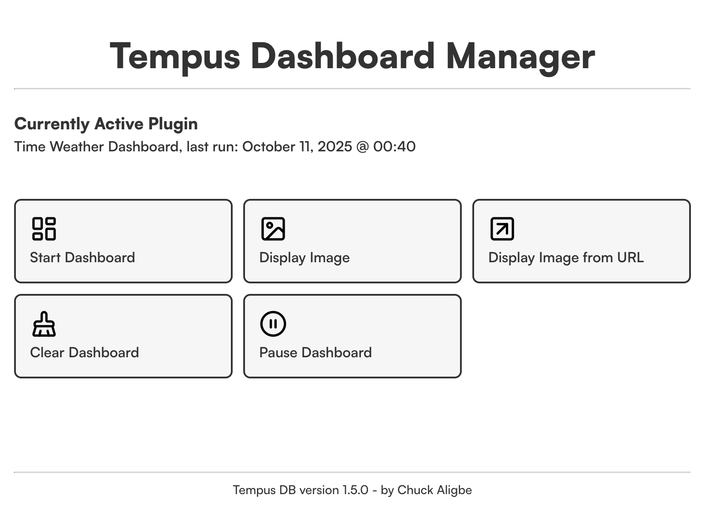

# Tempus DB

An open-source, Raspberry Pi-powered e-ink display, with multiple apps for the display and a web UI to manage them. The software, written in Python, is designed for the Waveshare 7.5-inch e-ink display, and the web UI is powered by Flask. 



## About Tempus DB

Tempus DB is an internet-connected e-ink display, powered by a Raspberry Pi. The software is written in Python 3 (somewhat hackily), and the web UI is powered by Flask and written with HTML, CSS, and JS. The interface allows the user to control the Tempus Dash from any device on their local network. Setting up the software will require some initial Terminal commands, but once installed, the software is easy to manage.

**Tempus Dash Apps:**

- Time-Weather Dashboard: displays the time as a 24-hr clock as well as the current weather and daily forecast at a regular interval.
- Photo Display: display a photo uploaded to the Raspberry Pi via the web UI
- Photo Display from URL: display a photo from a URL input in the web app.

Expect more apps soon. And feel free to adapt the code yourself and add more apps.

## Tempus Hardware

My Tempus uses an old Raspberry Pi 3b+ that I had from another project, and that is more than sufficient for running the apps and web UI server. For Tempus DB, you will need:

- A Raspberry Pi 4 / 3 / Zero 2 WH
- MicroUSB power adapter, 5V
- MicroSD card
- [Waveshare 7.5 in e-ink display w/ HAT](https://www.waveshare.com/7.5inch-e-paper-hat.htm)
- Picture frame or 3D printed frame
	- There are lots of options for the frame to purchase or print if you have a 3D printer
	- I designed and printed my own frame: [Minimalist Waveshare E-ink Display Frame]([https://printables.com](https://www.printables.com/model/1450561-minimal-waveshare-75-in-e-paper-display-frame))

## Installation

After setting up your Raspberry Pi, installing the Waveshare utilities for the e-ink display, connecting the display to the Pi, and testing the display for functionality (please see the respective instructional guides for Raspberry Pi setup and Waveshare display setup), you are ready to set up the Tempus software.

1. Clone the repo 

	```bash
	git clone https://github.com/cealigbe/tempusdash.git
	```

2. Navigate to the source code directory

	```bash
	cd tempusdash/src
	```

3. Install the Python requirements

	```bash
	pip3 install -r requirements.txt
	```

4. To initialize the weather display, grab a free WeatherAPI key from [weatherapi.com](http://weatherapi.com), then add your new key to the config.py file in the src folder. The weather script won't run otherwise

	```python
	config = {
		"location": "[your city]",
		"apikey": "[your api key]",
		...
	}
	```

5. Run the quickstart.py script to initialize the time-weather dashboard. This will set up a cron job to update the display every 10 minutes.

	```bash
	python3 quickstart.py
	```

6. To set up the web app, open up the tempusapp.service file and replace the bracketed areas in these lines to point to your tempusdash directory and Pi username:

	```
	...
	ExecStart=[/path/to]/tempusdash/src/manage/app.py
	User=[your Pi username]
	WorkingDirectory=[/path/to]/tempusdash/src/manage
	...
	```

7. Copy the tempusapp.service file to ```/etc/systemd/system/``` and restart the systemd daemon.

	```bash
	cp tempusapp.service /etc/systemd/system/
	sudo systemctl daemon-reload
	```

8. Ensure the Flask app is executable

	```bash
	sudo chmod +x manage/app.py
	```
	
9. Enable and start the tempusapp service. Then check the service to see if it is running.
	
	```bash
	sudo systemctl enable tempusapp.service
	sudo systemctl start tempusapp.service
	sudo systemctl status tempusapp.service
	```
	
10. To access the web UI, visit [your Pi's IP address]:5555 on a browser on another device. For example, if your Pi's IP address is 10.0.0.10, or is called "raspberrypi" visit, ```http://10.0.0.10:5555``` or ```http://raspberrypi.local:5555```.

	

## Future Features

I am an amateur programmer, so the code base of Tempus is somewhat janky. It works well, but don't be surprised if there is a bug or two. In any case, I will be working to optimize the code as I notice weirdness. I will also incrementally add features as I see a need for them. Future apps to the Tempus Dash include:

- Calendar
- Word of the Day
- Stock Ticker
- Webpage Screenshot
- Slideshow

Of course, feel free to build your own Tempus apps if you are capable. And if you want to contribute to the project, please feel free. 

## License

This project is distributed under the MIT License, see [LICENSE](https://github.com/cealigbe/tempusdash/blob/main/LICENSE) for more info. 

## Attributions

- Interface Typeface: [Satoshi](https://www.fontshare.com/?q=Satoshi) by Fontshare
- Weather Icons: [Weather API Icons](https://www.figma.com/community/file/1102960831369614781/weather-api-icons) by Roman Davydko
- Web UI Icons: [Lucide Icons](https://lucide.dev/)
- Waveshare e-ink library by [Waveshare](https://www.waveshare.com/)

## Inspirations

Tempus Dash was inspired by these e-ink dashboard projects:

- [TRMNL](https://usetrmnl.com/): an amazing open-source, off-the-shelf e-ink display with lots of prebuilt apps
- [InkyPi](https://github.com/fatihak/InkyPi): customizable e-ink display software designed to run on Raspberry Pi, with lots of customizable plug-ins
- [MagInkDash](https://github.com/speedyg0nz/MagInkDash): an e-ink dashboard that displays weather, calendar, and world facts.
- [E-Ink Weather and News](https://sambroner.com/posts/raspberry-pi-weather): an e-ink weather and news dashboard by Sam Broner
- [E-Ink Weather Display](https://github.com/kimmobrunfeldt/eink-weather-display): a battery-powered e-ink weather display
- [Dayloader Clock](https://www.instagram.com/reel/DJMb8FkuTcL/): a progress-bar style clock by Unnecessary Inventions that tells you the current day's progress


